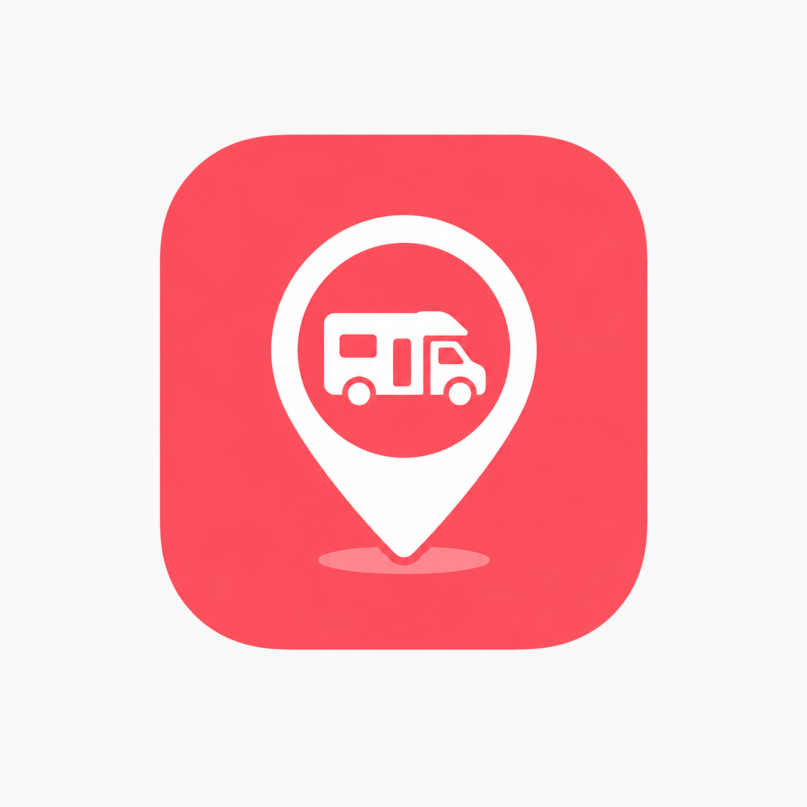
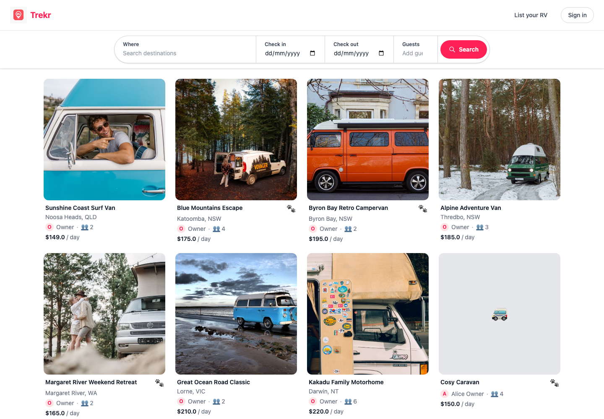

# Trekr RV Marketplace

Rails API for an RV/caravan marketplace, backed by PostgreSQL and containerised with Docker Compose. The local stack runs Rails, PostgreSQL, Redis, and Sidekiq as separate services.

<p align="center">
  
</p>

<p align="center">
  
</p>

## Implementation Details
- Developed using Claude Code with Matt Pocock's agent skills
- Rails 8.0.5
- Ruby 3.3.11 in Docker
- PostgreSQL 16
- Redis 7
- Sidekiq 8
- React + Vite frontend in `frontend/`

## Contents
- [Development With Docker](#development-with-docker)
- [Useful Docker Commands](#useful-docker-commands)
- [Background Jobs](#background-jobs)
- [Swagger API Documentation](#swagger-api-documentation)
- [API Examples](#api-examples-curl)
- [Frontend](#frontend)

## Development With Docker

Build and start the full local stack:

```bash
docker compose up --build
```

This starts:

- `web`: Rails/Puma API on http://localhost:3000
- `db`: PostgreSQL, available to other containers as `db`
- `redis`: Redis, available to other containers as `redis`
- `sidekiq`: background worker using Redis

Prepare the database:

```bash
docker compose exec web bin/rails db:prepare
```

Run the test suite:

```bash
docker compose exec web bundle exec rspec
```

## Useful Docker Commands

```bash
docker compose ps
docker compose logs -f web
docker compose logs -f sidekiq
docker compose exec web bin/rails console
docker compose exec web bin/rails runner 'puts ActiveRecord::Base.connection.adapter_name'
docker compose exec redis redis-cli ping
docker compose exec db psql -U postgres -l
docker compose down
```

Reset local Docker database state:

```bash
docker compose down -v
docker compose up --build
docker compose exec web bin/rails db:prepare
```

`docker compose down -v` deletes Compose-managed volumes, including the local PostgreSQL data volume.

## Background Jobs

Active Job is configured to use Sidekiq. Sidekiq stores jobs in Redis and runs them in the separate `sidekiq` container.

Smoke test the worker:

```bash
docker compose exec web bin/rails runner 'DockerSmokeJob.perform_later("sidekiq is working")'
docker compose logs -f sidekiq
```

You should see `DockerSmokeJob` run in the Sidekiq logs.

## Swagger API Documentation

1. Ensure the Docker stack is running.
2. Open the Swagger UI in your browser:
   - Default: http://localhost:3000/api-docs
   - If you mapped a different host port, replace `3000` with that port.
3. Raw OpenAPI artifact (if you need it):
   - JSON: http://localhost:3000/api-docs/v1/swagger.json
   - YAML: http://localhost:3000/api-docs/v1/swagger.yaml
4. Regenerate the OpenAPI doc from rswag specs (run inside container or on host):
```bash
# from host (with docker running)
docker compose exec web bundle exec rake rswag:specs:swaggerize

# or on host machine without docker
bundle exec rake rswag:specs:swaggerize
```
5. If the UI fails to load or 404s for the OpenAPI file, check `config/initializers/rswag_ui.rb` and ensure the `openapi_endpoint` points at the file you generated (e.g. `/api-docs/v1/swagger.json`).

Quick checks
```bash
# fetch the generated JSON to confirm it's served
curl -sS http://localhost:3000/api-docs/v1/swagger.json | jq '.info.title'  # requires jq
```

## API Examples (curl)

Replace <TOKEN>, <LISTING_ID>, and <BOOKING_ID> with values returned by the API.

### Auth / Users
```bash
# Register
curl -i -X POST http://localhost:3000/users \
   -H "Content-Type: application/json" \
   -d '{"user":{"email":"alice@example.com","password":"password","password_confirmation":"password","name":"Alice"}}'

# Sign in (returns Authorization: Bearer <token> header)
curl -i -X POST http://localhost:3000/users/sign_in \
   -H "Content-Type: application/json" \
   -d '{"user":{"email":"alice@example.com","password":"password"}}'

# Note: extracting the JWT token from the sign-in response
# The sign-in endpoint returns the JWT in the response headers as
# `Authorization: Bearer <token>`. When using curl with `-i` (or
# `--include`) the response headers are printed. You can capture the
# token into a shell variable like this (POSIX / zsh / bash):

# store the raw Authorization header value, then strip the leading "Bearer "
TOKEN=$(curl -i -s -X POST http://localhost:3000/users/sign_in \
   -H "Content-Type: application/json" \
   -d '{"user":{"email":"alice@example.com","password":"password"}}' \
   | awk -F": " '/[Aa]uthorization/ {print $2}' \
   | tr -d '\r' \
   | sed 's/^Bearer //')

# Now use the token in subsequent requests:
# -H "Authorization: Bearer $TOKEN"

# Sign out
curl -i -X DELETE http://localhost:3000/users/sign_out \
    -H "Authorization: Bearer <TOKEN>"
```

### Listings
```bash
# List public listings
curl -sS http://localhost:3000/api/v1/listings | jq '.'

# Create listing (authenticated user)
curl -i -X POST http://localhost:3000/api/v1/listings \
   -H "Content-Type: application/json" \
   -H "Authorization: Bearer <TOKEN>" \
   -d '{"listing":{"title":"My RV","description":"Nice caravan","rv_type":"caravan","town":"Portland","state":"OR","postcode":"97201","price_per_day":100,"max_guests":2}}'

# Show a listing
curl -sS http://localhost:3000/api/v1/listings/<LISTING_ID> | jq '.'

# Update a listing (owner only)
curl -i -X PUT http://localhost:3000/api/v1/listings/<LISTING_ID> \
   -H "Content-Type: application/json" \
   -H "Authorization: Bearer <TOKEN>" \
   -d '{"listing":{"title":"Updated title"}}'

# Delete a listing (owner only)
curl -i -X DELETE http://localhost:3000/api/v1/listings/<LISTING_ID> \
   -H "Authorization: Bearer <TOKEN>"
```

### Bookings
```bash
# Create a booking (hirer, not owner)
curl -i -X POST http://localhost:3000/api/v1/listings/<LISTING_ID>/bookings \
   -H "Content-Type: application/json" \
   -H "Authorization: Bearer <TOKEN>" \
   -d '{"booking":{"start_date":"2025-09-10","end_date":"2025-09-14"}}'

# Confirm a booking (owner only)
curl -i -X PATCH http://localhost:3000/api/v1/bookings/<BOOKING_ID>/confirm \
   -H "Authorization: Bearer <TOKEN>"

# Reject a booking (owner only)
curl -i -X PATCH http://localhost:3000/api/v1/bookings/<BOOKING_ID>/reject \
   -H "Authorization: Bearer <TOKEN>"

# List bookings (owner or hirer)
curl -sS -H "Authorization: Bearer <TOKEN>" http://localhost:3000/api/v1/bookings | jq '.'
```

### Chats & Messages
```bash
# Start or resume a chat about a listing (creates the chat and sends the first message)
curl -i -X POST http://localhost:3000/api/v1/listings/<LISTING_ID>/chats \
   -H "Content-Type: application/json" \
   -H "Authorization: Bearer <TOKEN>" \
   -d '{"message":{"content":"Is this available?"}}'
# Returns 201 if a new chat is created, 200 if an existing chat is resumed.
# The response includes the chat object with its id (use <CHAT_ID> below).

# List all chats for the current user (as hirer and as owner)
curl -sS -H "Authorization: Bearer <TOKEN>" http://localhost:3000/api/v1/chats | jq '.'

# Show a chat with all messages
curl -sS -H "Authorization: Bearer <TOKEN>" http://localhost:3000/api/v1/chats/<CHAT_ID> | jq '.'

# List messages in a chat
curl -sS -H "Authorization: Bearer <TOKEN>" http://localhost:3000/api/v1/chats/<CHAT_ID>/messages | jq '.'

# Send a message in an existing chat
curl -i -X POST http://localhost:3000/api/v1/chats/<CHAT_ID>/messages \
   -H "Content-Type: application/json" \
   -H "Authorization: Bearer <TOKEN>" \
   -d '{"message":{"content":"Yes, it is available!"}}'
```

## Frontend

Vite + React SPA in `frontend/`; Rails runs in Docker and serves the API behind `/api`.

### Setup And Run

```bash
cd frontend
npm install
npm run dev  # http://localhost:5173
```

The dev server proxies requests starting with `/api` to `http://localhost:3000` (see `frontend/vite.config.js`). Ensure Rails container is running.

### CORS

Configured via `config/initializers/cors.rb`.

```bash
ALLOWED_ORIGINS=http://localhost:5173 docker compose up -d
```

### Build Production Bundle

```bash
cd frontend
npm run build
# Output: frontend/dist
```

You can serve the contents of `frontend/dist` via a static host (e.g., Nginx) or copy into `public/`.

### Listing component
`ListingList.jsx` fetches from `/api/v1/listings` and renders simple cards. Provide a JWT in the input to test authenticated calls (not required for public listing index).
